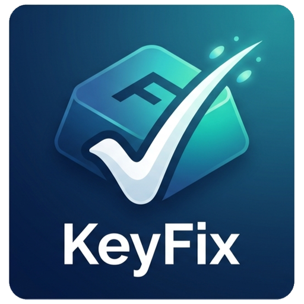

<p align="center">
  
</p>

<h1 align="center">KeyFix</h1>

<p align="center">
  تطبيق Windows يعمل من شريط النظام ويحترم الخصوصية، ويصحّح نوعين من أخطاء الكتابة:
  الكتابة <b>بلغة لوحة مفاتيح خاطئة</b>، والأخطاء <b>الإملائية</b> العادية.
  يعمل دون اتصال بالكامل، ومتحفّظ افتراضياً.
</p>

<p align="center">
  <a href="https://github.com/miladateight/KeyFix/actions/workflows/build.yml"></a>
  
  
  <a href="https://github.com/miladateight/KeyFix/releases/latest"></a>
  <a href="LICENSE"></a>
</p>

<p align="center">
  <a href="https://ateight.xyz/KeyFix/">الموقع</a> ·
  <a href="https://github.com/miladateight/KeyFix/releases/latest">أحدث إصدار</a> ·
  <a href="PRIVACY.md">الخصوصية</a> ·
  <a href="CHANGELOG.md">سجل التغييرات</a>
</p>

<p align="center">
  <b>اللغات:</b>
  <a href="README.md">English</a> ·
  <a href="README.fa.md">فارسی</a> ·
  <a href="README.ar.md">العربية</a> ·
  <a href="README.de.md">Deutsch</a>
</p>

## لماذا KeyFix؟

عند التنقّل بين الإنجليزية والفارسية والعربية والألمانية أثناء الكتابة، من السهل نسيان لغة لوحة المفاتيح الحالية. تريد كتابة `hello` لكن اللغة النشطة فارسية فيتحوّل النص إلى `اثممخ`. يكتشف KeyFix هذا النوع من الأخطاء محلياً بالكامل ويساعدك على تصحيحه قبل أن يصبح جزءاً من الجملة.

إضافةً إلى ذلك، يستطيع KeyFix تصحيح الأخطاء الإملائية العادية (عندما تكون لغة لوحة المفاتيح صحيحة). الميزتان منفصلتان تماماً، والبرنامج يعرف دائماً أي نوع من التصحيح يقترحه.

## اللغات المدعومة

- الإنجليزية
- الفارسية
- العربية
- الألمانية

مهم: بعد تثبيت KeyFix افتح **Settings** واترك مفعّلة فقط اللغات التي تستخدمها فعلاً، وعطّل الباقي. هذا يحسّن دقة الكشف ويقلّل التصحيحات غير المرغوبة.

## ميزات الإصدار 0.6.0

- تطبيق يعمل من شريط النظام مع لوحة إعدادات مُدمجة
- إعداد أوّلي لاختيار اللغات التي تستخدمها فعلاً
- تفعيل/تعطيل كل لغة بشكل مستقل
- ثلاثة أوضاع للكشف: `AlertOnly` و`AlertAndSuggest` و`AutoSwitch`
- تصحيح الكلمة السابقة بعد الضغط على Space (وليس أثناء الكتابة)
- كشف يعتمد على قوائم كلمات مرتّبة حسب التكرار لجميع اللغات الأربع
- تصحيح إملائي اختياري يعمل دون اتصال (فهرس من نوع SymSpell)، **مُعطَّل افتراضياً**
- محرّك قرار متحفّظ مع هامش لمنع الالتباس وتحكّم `Conservative`/`Balanced`/`Aggressive`
- كشف الرموز المحمية (روابط، بريد، مسارات، إصدارات، معرّفات برمجية...) لتجنّب التصحيح الخاطئ
- قاموس شخصي محلي مع import/export وأزواج استبدال اختيارية
- استبدال نص سريع عبر Unicode مع مسار احتياطي محمي للحافظة
- تشغيل تلقائي مع بدء Windows (اختياري)
- صوت تنبيه افتراضي من Windows وإمكانية اختيار ملف `.wav` مخصّص
- إشعارات Windows
- قائمة تطبيقات مستثناة للطرفيات ومديري كلمات المرور والتطبيقات الحسّاسة
- كشف محلي بالكامل، بلا telemetry وبلا خادم بعيد

## نوعان من التصحيح

يفصل KeyFix بين مشكلتين ويمكنك التحكّم بكلٍّ منهما بشكل مستقل في **Settings**:

| الإعداد | ما يصحّحه | مثال | الافتراضي |
| --- | --- | --- | --- |
| تصحيح الكتابة بلغة لوحة مفاتيح خاطئة | ضغطتَ المفاتيح الصحيحة بلغة خاطئة | `اثممخ` ← `hello` | مُفعّل |
| تصحيح الأخطاء الإملائية العادية | خطأ حقيقي واللغة صحيحة | `recieve` ← `receive` | **مُعطّل** |

التصحيح الإملائي التلقائي مُعطّل افتراضياً؛ فعّله (وخيار «التطبيق التلقائي» إن رغبت) فقط عند الحاجة.

## أوضاع الكشف

| الوضع | ما يفعله |
| --- | --- |
| `AlertOnly` | تنبيه فقط (صوت/إشعار) دون تغيير أي نص. |
| `AlertAndSuggest` | ينبّه ويقترح اللغة/الكلمة الأنسب. |
| `AutoSwitch` | يصحّح الكلمة بعد Space ويغيّر لغة الإدخال. |

## طريقة العمل

يحتفظ KeyFix بمخزن قصير في الذاكرة لآخر الأحرف. عند الضغط على Space يفحص الكلمة السابقة، وإذا كانت لغة أخرى أكثر احتمالاً بوضوح، يمكنه حذف الكلمة الخاطئة وإدخال النص الصحيح وتغيير لغة الإدخال.

مثال اللغة الخاطئة:

```text
المطلوب: hello
اللغة النشطة: الفارسية
المكتوب: اثممخ
المصحّح: hello
```

مثال إملائي (فقط عند تفعيل التصحيح الإملائي):

```text
اللغة النشطة: الإنجليزية
المكتوب: recieve
الاقتراح: receive
```

يُمسح المخزن بعد Enter وTab واللغات غير المدعومة والتطبيقات المستثناة والتصحيح التلقائي.

## الرموز المحمية

لتجنّب التصحيح الخاطئ، لا يصحّح KeyFix أي شيء ليس كلمة عادية. تشمل الرموز المحمية: الروابط والبريد الإلكتروني ومسارات الملفات وخيارات سطر الأوامر (`--configuration`) وأرقام الإصدارات (`v0.6.0`) والنطاقات والوسوم والإشارات والمعرّفات البرمجية (`camelCase` و`PascalCase` و`snake_case` و`SCREAMING_SNAKE`) والاختصارات والأرقام والرموز المختلطة (حروف وأرقام) والإيموجي. كما تُستثنى الطرفيات ومديرو كلمات المرور بالكامل عبر قائمة التطبيقات المستثناة.

## القاموس الشخصي

يمكنك الاحتفاظ بقاموس شخصي محلي بكلماتك الخاصة. الكلمات التي تضيفها تُعامَل دائماً كصحيحة ولا تُصحَّح أبداً، ويمكنك تعريف أزواج استبدال (مثل اختصار يتوسّع إلى صيغة أطول). يدعم القاموس add وremove وlist وimport (نص UTF-8) وexport، ويُخزَّن محلياً في:

```text
%APPDATA%\KeyFix\user-dictionary.json
```

## حِدّة التصحيح

يتحكّم إعداد واحد باسم «How eager» في مدى الثقة المطلوبة قبل أن يتصرّف KeyFix:

| المستوى | السلوك |
| --- | --- |
| `Conservative` | يصحّح فقط عند ثقة عالية جداً وبلا التباس. الافتراضي. |
| `Balanced` | توازن بين التقاط الأخطاء وتجنّب التصحيح الخاطئ. |
| `Aggressive` | تصحيح أكثر جرأة؛ التقاط أكثر بمخاطرة أعلى قليلاً. |

يتطلّب التصحيح التلقائي دائماً أن يتجاوز أفضل مرشّح عتبة الثقة **و** أن يتفوّق على المرشّح التالي بهامش واضح، لذلك لا تُصحَّح الحالات الملتبسة تلقائياً أبداً.

## التثبيت

حمّل أحدث مثبّت من صفحة [Releases في GitHub](https://github.com/miladateight/KeyFix/releases/latest):

```text
KeyFixSetup-0.6.0.exe
```

بعد التثبيت:

1. شغّل KeyFix من قائمة Start.
2. افتحه من شريط النظام.
3. افتح **Settings**.
4. فعّل فقط اللغات التي تستخدمها.
5. عطّل اللغات غير المستخدمة.
6. اختر أن ينبّه فقط، أو يقترح، أو يغيّر اللغة ويصحّح النص تلقائياً.

## الخصوصية

صُمّم KeyFix كي لا يخزّن نص المستخدم.

- لا يُحفظ النص المكتوب على القرص.
- لا يُرفع النص إلى أي خادم.
- لا يوجد telemetry ولا SDK تحليلي ولا خادم بعيد.
- يُستخدم مخزن قصير في الذاكرة فقط للكشف.
- تُحفظ الإعدادات في `%APPDATA%\KeyFix\settings.json`.
- يُحفظ القاموس الشخصي محلياً في `%APPDATA%\KeyFix\user-dictionary.json` ولا يُرفع أبداً.
- قائمة الاستثناء الافتراضية تشمل مديري كلمات المرور والطرفيات.

اقرأ المزيد في [PRIVACY.md](PRIVACY.md).

## متطلّبات التطوير

- Windows 10 أو Windows 11
- .NET 8 SDK
- اختياري: Visual Studio 2022
- اختياري: Inno Setup 6 لبناء المثبّت

## البناء والاختبار

```powershell
.\scripts\build.ps1
```

بناء واختبار يدوي:

```powershell
dotnet build .\KeyboardLanguageGuard.sln --configuration Release
dotnet test .\KeyboardLanguageGuard.sln --configuration Release
```

## التشغيل محلياً

```powershell
dotnet run --project .\src\KeyboardLanguageGuard.App\KeyboardLanguageGuard.App.csproj
```

## إنشاء المثبّت

```powershell
.\scripts\package-installer.ps1
```

يُكتب الناتج في:

```text
artifacts\installer\
```

يعرض معالج التثبيت شعار AT8. يستخدم أيقونةُ التطبيق والمثبّت أيقونةَ KeyFix. كما يتضمّن التثبيت شكراً خاصاً لأشكان غريب على الفكرة الأصلية.

## بنية المشروع

```text
src/
  KeyboardLanguageGuard.Core/   منطق التصحيح والقواميس وخرائط لوحة المفاتيح
  KeyboardLanguageGuard.App/    تطبيق Tray وواجهة الإعدادات والخطافات وخدمات التصحيح
tests/
  KeyboardLanguageGuard.Tests/  مجموعة اختبارات xUnit
installer/                      سكربت Inno Setup وملفاته
assets/                         الشعارات والأيقونات
scripts/                        سكربتات build وpublish وpackage
.github/                        Workflows الخاصة بـ GitHub Actions
```

## روابط مفيدة

- موقع المشروع: [ateight.xyz/KeyFix](https://ateight.xyz/KeyFix/)
- المستودع: [github.com/miladateight/KeyFix](https://github.com/miladateight/KeyFix)
- أحدث إصدار: [releases/latest](https://github.com/miladateight/KeyFix/releases/latest)
- الخصوصية: [PRIVACY.md](PRIVACY.md)
- الأمان: [SECURITY.md](SECURITY.md)
- إشعارات الطرف الثالث: [THIRD_PARTY_NOTICES.md](THIRD_PARTY_NOTICES.md)

## خارطة الطريق

مُخطّط له لإصدارات لاحقة (غير موجود في 0.6.0):

- تراجع بخطوة واحدة عن التصحيح التلقائي
- تعلّم محلي يتكيّف مع تصحيحاتك المقبولة والمرفوضة
- نموذج سياق bigram خفيف لتحسين التقييم
- منطقة اختبار تشخيصية داخل التطبيق وتسجيل تشخيصي محلي اختياري
- أداة تقييم دون اتصال بقياس precision/recall
- ملفّات تعريف تصحيح لكل تطبيق
- ترجمة كاملة لواجهة الإعدادات
- توقيع رقمي للمثبّت

## المساهمة

المساهمات مُرحّب بها. يُرجى قراءة [CONTRIBUTING.md](CONTRIBUTING.md) قبل فتح Pull Request. للتقارير الأمنية استخدم الآلية في [SECURITY.md](SECURITY.md).

## الترخيص

يصدر KeyFix بموجب [ترخيص MIT](LICENSE).
